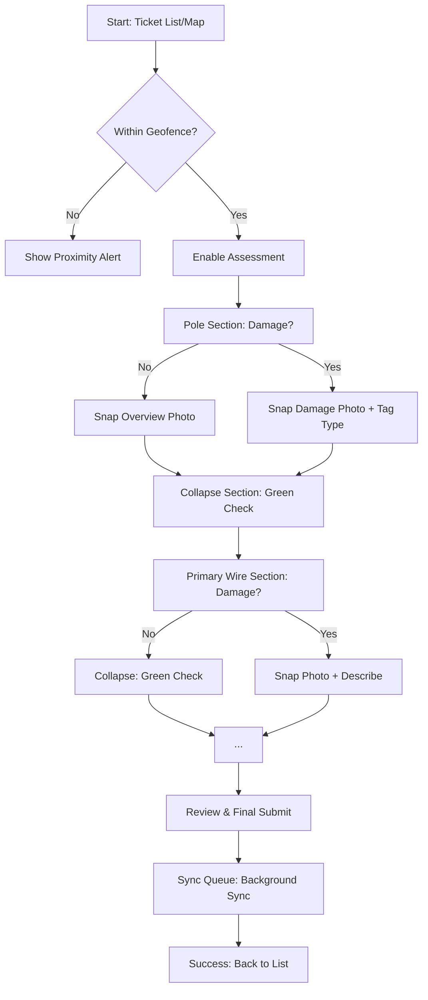
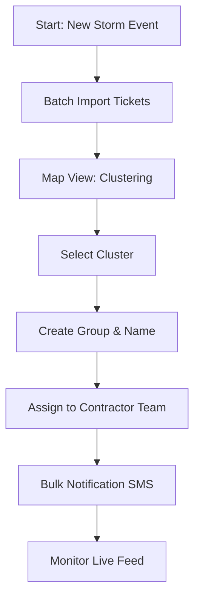
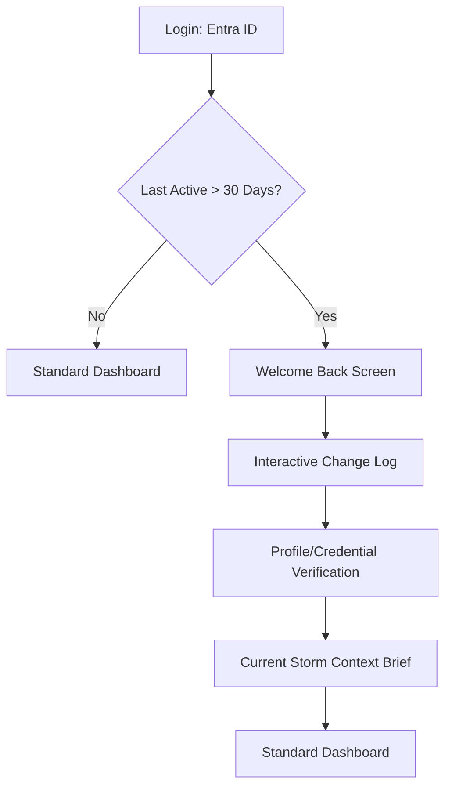

# UX Design Specification Grid2

**Author:** David
**Date:** 2026-02-11

---

## Executive Summary

### Project Vision

Grid2 is a centralized operational command center for utility damage assessment and storm restoration. The core vision is to replace fragmented, people-dependent oversight with system-driven execution. By enforcing data quality at the point of entry via a robust PWA, Grid2 ensures absolute data integrity, transforming chaotic field reports into a "trust-by-default" dashboard for business leadership.

### Target Users

- **Super Admin (Jeanie)**: The strategic lead who requires real-time, validated operational visibility to lead rather than "police" storm deployments.
- **Admin (Marcus)**: Seasonal staff who require frictionless re-activation after months of dormancy and clear, checklist-driven workflows.
- **Contractor (DeShawn)**: Field assessors who need a fast, intuitive mobile-first experience to capture high-density damage data with zero ambiguity.

### Key Design Challenges

- **Standard Field Usability**: Optimizing for high-glare outdoor environments and one-handed mobile use, without the need for extreme weather ergonomics (normal touch targets are sufficient).
- **Resilient Offline UX**: Providing a local-first experience that eliminates "data anxiety" through seamless background synchronization.
- **Cognitive Load Management**: Translating complex utility infrastructure assessments into a guided, conditional flow that minimizes manual keyboard entry.

### Design Opportunities

- **Operational Nervous System**: Creating a high-signal dashboard that provides immediate trust and situational awareness during active storm windows.
- **Guided Assessment Intelligence**: Leveraging top-down conditional logic to make the assessment process feel like a guided conversation, ensuring >95% first-attempt acceptance.

## Core User Experience

### Defining Experience

The heart of the Grid2 experience is the **Verifiable Guided Assessment**. It transforms complex technical data entry into a structured, hierarchical conversation (Pole → Wire → Equipment) that guides field assessors through every required data point while enforcing data quality at the source.

### Platform Strategy

Grid2 is a **Progressive Web App (PWA)** optimized for two distinct contexts:
- **Mobile Contractor Portal**: Optimized for touch-first, one-handed operation on smartphones in high-glare field environments. Uses Dexie.js for a robust offline-first architecture.
- **Desktop/Tablet Admin Portal**: Optimized for information density and dashboard-driven operational control.

### Effortless Interactions

- **Top-Down Conditional Flow**: Sections automatically expand and collapse based on "Any Damage?" responses, minimizing cognitive load.
- **Silent Background Syncing**: A subtle status-bar indicator manages user expectations without blocking field workflows, ensuring zero "data anxiety."
- **Automatic Metadata Capture**: GPS coordinates and timestamps are silently embedded into every photo and submission.

### Critical Success Moments

- **The "No-Ghost" Visit**: The moment a contractor attempts to submit a "No Damage" report and is guided to provide a geofenced "Proof of Visit" overview photo, ensuring Jeanie's trust in the data.
- **First-Time Dashboard Trust**: When Super Admin Jeanie opens the command center during a storm and sees a real-time, validated overview of field progress without manual cross-referencing.

### Experience Principles

- **Quality First, Submission Second**: Mandatory field validation and geofencing ensure all data is actionable upon arrival.
- **Verifiable Presence**: Every report, including "No Damage," must be backed by a geofenced GPS check and visual proof.
- **Resilient Reliability**: Field workers must feel that the app is a stable tool that "never loses data," regardless of connectivity.
- **High-Signal Visibility**: Dashboards prioritize actionable exceptions and high-level status over raw, unvalidated data streams.

## Desired Emotional Response

### Primary Emotional Goals

The primary emotional goal for Grid2 is **Operational Certainty**. Users, from field assessors to strategic leadership, should feel absolute confidence in the system's accuracy and stability.

### Emotional Journey Mapping

- **First Discovery**: **Intrigue and professional validation**. Field workers should feel that the tool was built by someone who actually understands their job.
- **During Core Action**: **Focus and flow**. The interface should disappear, allowing the assessor to move purposefully through infrastructure hierarchy.
- **After Task**: **Closure and relief**. A definitive "Submission Complete" moment that releases the user from responsibility for that ticket.
- **When Disconnected**: **Reassurance**. Instead of anxiety, the user feels supported by local-first persistence ("Your data is safe").

### Micro-Emotions

- **Confidence**: High-contrast, unambiguous states.
- **Trust**: Consistent data representation across all portals.
- **Professionalism**: A tool-like aesthetic that honors the expertise of the user.

### Design Implications

- **System Aesthetic**: Using a clean, functional "dashboard" style that prioritizes utility over decoration to build trust.
- **Direct Feedback**: Immediate visual confirmation for every action (geofence hit, photo saved, field validated).
- **Proactive Communication**: Using the "Silent Sync" cloud to manage technical anxiety without interruption.

### Emotional Design Principles

- **Tool, Not Toy**: Every UI element must serve a functional purpose.
- **Constant Reassurance**: The system always answers "Where am I?", "What's next?", and "Is my work safe?"
- **Respect the Professional**: Minimize hand-holding; maximize technical guidance and efficiency.

## UX Pattern Analysis & Inspiration

### Inspiring Products Analysis

- **Google Maps**: Gold standard for spatial data clarity and contextual secondary actions ("Search along route").
- **Instagram**: High-speed, visual-first interaction loop with effortless upload feedback.
- **TurboTax**: Masterful "guided interview" approach that simplifies complex, hierarchical technical data entry.

### Transferable UX Patterns

- **Navigation Patterns**:
  - **Bottom Navigation (Maps-style)**: Touch-friendly switching between core field modes (Tickets, Map, Profile).
  - **Progress Stepper (TurboTax-style)**: Visual indicators for the 6-step assessment hierarchy (Pole → Wire → Equipment).
- **Interaction Patterns**:
  - **Tap-to-Advance**: Automatically focusing the next logical field or section after a valid entry.
  - **Conditional Card Expansion**: Progressive disclosure of technical fields based on damage status.
- **Visual Patterns**:
  - **High-Contrast Status Indicators**: Unambiguous icon+color pairings for operational status (Green/Check, Amber/Warning).

### Anti-Patterns to Avoid

- **Infinite Scrolling Forms**: Prevents users from tracking progress and causes fatigue in the field.
- **Late-Stage Validation**: Discovering errors at the end of a form is a major point of frustration; validation must be inline.
- **Modal-Heavy Workflows**: Modals break focus; critical actions like photo capture should be embedded in the flow.

### Design Inspiration Strategy

- **What to Adopt**: The "Guided Interview" logic will be the primary engine for damage assessments to ensure data quality.
- **What to Adapt**: Google Maps spatial search patterns will be adapted for circuit-level ticket discovery in the field.
- **What to Avoid**: Gestural-only navigation and dense technical paragraphs will be avoided to maintain clarity in high-glare environments.

## Design System Foundation

### 1.1 Design System Choice

**Shadcn/UI + Tailwind CSS**.

### Rationale for Selection

- **AI-Friendly Codebase**: Shadcn/UI provides clean, accessible React components that are easy for AI agents to understand and extend.
- **Professional System Aesthetic**: Naturally aligns with the functional, high-signal "System Look" required for an operational command center.
- **Rapid Prototyping**: Tailwind CSS enables high-speed responsive styling, critical for meeting the 30-day MVP target.
- **Modern Accessibility**: Built-in ARIA support ensures compliance with WCAG 2.1 Level AA standards.

### Implementation Approach

- **Component-First**: Use standard Shadcn primitives (Card, Button, Form, Stepper) for all core interactions.
- **Mobile-First Layouts**: Leverage Tailwind's responsive prefixes to ensure perfect rendering from smartphone to desktop.
- **Local-First Sync**: Integrated Dexie.js hooks to drive UI sync states.

### Customization Strategy

- **Operational Color Tokens**: Define a strict color palette centered on "Actionability" (e.g., Grid Green for success, Storm Amber for warnings, Circuit Blue for informational metadata).
- **High-Contrast "Field Mode"**: Use Tailwind themes to provide a high-contrast toggle for sunlight readability.
- **Ergonomic Spacing**: Standardize on a 44px minimum touch target for mobile actions.

## Core User Experience Mechanics

### Defining Experience

The core interaction that defines Grid2 is **"Capturing the Evidence."** It is the "Validated SNAP"—the moment a photo is captured, tagged with its infrastructure type (Pole, Primary, etc.), and immediately verified by the system as "Attached & GPS-Synced." This interaction makes the user feel successful and ensures 100% data integrity for strategic leadership.

### User Mental Model

Grid2 aligns with the professional's physical hierarchy: **"Pole → Wire → Equipment."** Unlike current manual methods where data is captured first and organized later, Grid2 allows the user to follow their natural gaze. The app is expected to mirror the physical reality in front of them, automatically hiding irrelevant data points to maintain focus and flow.

### Success Criteria

- **Zero-Friction Transitions**: The app automatically moves to the next logical infrastructure element upon evidence capture or a "No Damage" event.
- **Field Speed**: Completion of any "No Damage" section in under 15 seconds.
- **Immediate Verification**: GPS and timestamp validation completed within 1 second of photo capture.

### Novel UX Patterns

Grid2 utilizes a **"Zero-Keyboard" Field Interface**. By combining Instagram-speed "Snap-and-Tag" interactions with TurboTax-style conditional logic, we eliminate virtual keyboard usage in the field. High-density selection grids and large boolean toggles serve as the primary input mechanism, respecting the professional's need for speed and accuracy.

### Experience Mechanics

1. **Initiation**: The user taps a prominent "Add Photo" icon within an infrastructure-specific card.
2. **Interaction**: Inline camera opens; user snaps photo; user selects damage type from a 4-button quick-grid.
3. **Feedback**: A "Geofence Validated" indicator appears on the thumbnail; the card's progress bar increments.
4. **Completion**: Upon fulfilling mandatory evidence requirements, the card collapses into a summary state, and the next infrastructure card automatically expands to guide the next action.

## Design Direction Decision

### Design Directions Explored

Six distinct visual strategies were explored, ranging from high-density tablet "Command Decks" to minimalist "Rugged Utility" interfaces. Key focus areas included hierarchical walkthroughs, spatial map-centric discovery, and exception-based status signaling.

### Chosen Direction

We have selected a **Hybrid Operational Strategy** that adapts to the user's role:
- **Admin Portal**: A combination of **Direction 4 (The Status Signal)** for exception management and **Direction 5 (Map-Centric Ops)** for strategic assignment.
- **Contractor Portal**: A combination of **Direction 5 (Spatial Discovery)** for finding tickets and **Direction 2 (Focused Walkthrough)** for the linear, card-based assessment flow.

### Design Rationale

- **Role-Context Optimization**: Admins need to see "what is broken" (Strategic Model), while Contractors need to see "where to go" and "how to assess" (Hierarchical Model).
- **Cognitive Load Reduction**: The linear walkthrough (Dir 2) ensures that field workers only focus on one infrastructure element at a time, supporting our "Quality First" mandate.
- **Operational Trust**: Using high-signal status indicators (Dir 4) reinforces the goal of "Operational Certainty" for leadership.

### Implementation Approach

- **Unified Shell**: A consistent "Blue-Led" brand frame across all views.
- **Adaptive Components**: Sharing a common Shadcn/UI component library but varying the density and layout patterns based on viewport and role.
- **Contextual Switching**: Seamless transitions between Map views and Detail/Assessment views to maintain user flow.

## User Journey Flows

### Journey 1: The Field Assessment Cycle (DeShawn)

**Goal**: Complete a 100% valid damage assessment in the field with zero network dependency.

### Journey 2: The Storm Activation Loop (Jeanie)

**Goal**: Rapidly import tickets, group them, and deploy contractors.

### Journey 3: The Admin Re-activation (Marcus)

**Goal**: Catch up on 3 months of changes in under 30 minutes.

### Journey Patterns

- **Progressive Disclosure**: Using hierarchical cards to show only the relevant data points for the current physical focus (e.g., Pole first, then Wire).
- **Immediate Validation**: Performing geofence and photo integrity checks at the moment of capture, not at the end of the form.
- **Contextual Onboarding**: Implementing "Welcome Back" flows for seasonal admins to reduce the cognitive burden of account re-activation.

### Flow Optimization Principles

- **The 15-Second Pole**: Designing the "No Damage" path to be the fastest interaction in the app to encourage high-speed field audits.
- **Fail-Safe Persistence**: Every user interaction is saved locally to Dexie.js before any UI transition occurs, ensuring 100% data durability.
- **Zero-Ambiguity Navigation**: Using role-specific navigation patterns (Bottom Nav for mobile, Sidebar for desktop) to maximize familiarity.

## Component Strategy

### Design System Components

Grid2 leverages **Shadcn/UI** as its foundational component library, providing a suite of accessibility-tested primitives (Button, Input, Table, Dialog) that align with the "Clean Professional Tool" aesthetic.

### Custom Components

#### Hierarchy Card (The Smart Card)
- **Purpose**: Primary field assessment interface managing physical infrastructure sections.
- **Anatomy**: Section Header (Icon + Title), Completion Status Badge, Conditional Input Body, Inline Navigation Footer.
- **States**: Default (Collapsed), Active (Expanded), Validated (Green Check), marked "No Damage" (Collapsed Summary).

#### Validated Camera Interface
- **Purpose**: High-speed, verifiable evidence capture with immediate technical feedback.
- **Anatomy**: Viewfinder, Capture Action, Geofence/GPS Metadata Overlay, thumbnail preview with sync-status icon.
- **Interaction**: Thumb-optimized bottom-anchored controls with silent background sync trigger.

#### Operational Exception Badge
- **Purpose**: Instant strategic signaling for high-stakes dashboard exceptions.
- **Anatomy**: Shape-specific icons (Circle/Triangle/Square) paired with priority-coded colors.
- **Variants**: Critical (Pulsing Red), Warning (Solid Amber), Informational (Blue).

### Component Implementation Strategy

- **Architectural Neutrality**: Build custom components as pure React functional components using Tailwind tokens, ensuring they are portable across provider migrations.
- **Sync Integration**: Components listen to Dexie.js hooks to automatically reflect local vs. server-synced states in the UI.
- **Standardized Spacing**: All mobile-facing components adhere to a 44px minimum touch target.

### Implementation Roadmap

- **Phase 1 (MVP)**: Hierarchy Card (Contractor Assessment), Validated Camera, Standard Admin Tables (User/Ticket Management).
- **Phase 2 (Growth)**: Operational Exception Badges, Welcome Back Modals, Interactive Map Cluster Pins.
- **Phase 3 (Vision)**: Performance Analytics Data Visualization, Microsoft Graph Integration Components.

## UX Consistency Patterns

### Button Hierarchy

- **Primary (Blue-Led)**: Brand Blue (#0052CC) with White text. Reserved for primary flow progression (e.g., "Submit Assessment").
- **Secondary (Outline)**: Slate 200 Border with Slate 900 text. Used for optional branches or destructive confirmation (e.g., "Add Photo").
- **Special (Signal Yellow)**: Yellow (#FFD700) toggle for the "No Damage" fast-path interaction.

### Feedback Patterns

- **Operational Reassurance**: Subtle status-bar cloud icons for background sync status.
- **Exception Signaling**: High-contrast, shape-specific badges for critical errors or geofence violations.
- **Validation Feedback**: Immediate field-level border color changes (Green/Success, Amber/Warning) to eliminate "form anxiety."

### Form Patterns

- **Zero-Keyboard Strategy**: Prioritizing high-density 4-button selection grids and large boolean toggles over traditional text inputs.
- **Progressive Disclosure**: Utilizing conditional card expansion to hide technical complexity until it is physically relevant to the assessor.

### Navigation Patterns

- **Contextual Anchoring**: Role-specific fixed navigation (Bottom Nav for Mobile, Sidebar for Desktop) paired with technical breadcrumbs (Storm > Division > Circuit).
- **Action-at-Edge**: Anchoring primary field actions to the bottom of the mobile viewport for one-handed operation.

### Additional Patterns

- **The "Skeleton Grid"**: Using structure-aware loading states to maintain visual continuity during background data fetches.
- **The "Ready to Deploy" Empty State**: Proactive messaging in empty lists that guides the user toward operational readiness.

## Visual Design Foundation

### Color System

The visual identity is driven by a **"Blue-Led" Shell Strategy**, reinforcing the Grid Electric brand while prioritizing high-signal operational status.

- **Brand Primary**: `#0052CC` (Operational Blue) – Used for app headers, primary navigation, and "Success" buttons.
- **Brand Accent**: `#FFD700` (Signal Yellow) – Used for high-impact interactive states, active toggles, and warning icons.
- **Neutral System**: A Slate-based palette (Slate 50 to 950) provides professional "Asphalt" grounding and maximum text contrast.
- **Semantic Mapping**: 
  - **Success**: Grid Green (`#10B981`)
  - **Warning**: Storm Amber (`#F59E0B`)
  - **Error**: Critical Red (`#EF4444`)

### Typography System

Standardized on a **Technical San-Serif** pairing to ensure data legibility in high-stress field conditions.

- **Primary Typeface**: **Inter** – Chosen for its neutral, professional character and exceptional clarity at small sizes. Used for all labels, body text, and navigation.
- **Technical Typeface**: **JetBrains Mono** – Used strictly for Circuit IDs, Ticket Numbers, and Equipment tags to eliminate character ambiguity (e.g., distinguishing '0' from 'O').
- **Type Scale**: 16px base body text with a modular 1.25x scale for headings.

### Spacing & Layout Foundation

- **Base Unit**: 4px grid system ensuring consistent alignment across all components.
- **Density Strategy**: 
  - **Contractor Portal**: Low-density with 44px minimum touch targets for reliable field operation.
  - **Admin Portal**: High-density "Information Rich" layouts for strategic oversight.
- **Layout Principle**: **Action-at-Edge** – Primary field actions (Add Photo, Submit) are anchored to the bottom of the mobile viewport for one-handed thumb accessibility.

### Accessibility Considerations

- **Field Contrast**: All primary color pairings exceed WCAG 2.1 AA (4.5:1) contrast ratios to prevent washout in direct sunlight.
- **Multi-Modal Signaling**: Operational status is never conveyed by color alone; every indicator uses an **Icon + Color + Label** combination to ensure accessibility for color-blind users (~8% of the target workforce).

## Responsive Design & Accessibility

### Responsive Strategy

Grid2 adapts to the user's role and physical context through adaptive layouts:
- **Desktop (Admin)**: Multi-column "Command Deck" layout for high-density strategic oversight and ticket management.
- **Tablet (Admin/Lead)**: Touch-optimized sidebar and vertical stack detail views for mobile coordination.
- **Mobile (Contractor)**: Single-column vertical focus optimized for high-glare field assessment.

### Breakpoint Strategy

- **Compact (Mobile)**: 320px - 767px (Bottom Nav active).
- **Medium (Tablet)**: 768px - 1023px (2-column detail view).
- **Expanded (Desktop)**: 1024px+ (Persistent Sidebar active).

### Accessibility Strategy

Grid2 adheres to **WCAG 2.1 Level AA** standards to ensure operational safety for all users:
- **Contrast**: 4.5:1 minimum ratio for all UI elements; 7:1 target for "Field Mode."
- **Touch Ergonomics**: 44x44px minimum targets for all primary mobile interactions.
- **Multi-Modal Signaling**: All operational states (Success, Warning, Error) are distinguished by Icon, Shape, and Color.
- **Technical Precision**: JetBrains Mono typeface utilized for all technical identifiers to ensure zero character ambiguity.

### Testing Strategy

- **Device Validation**: Testing on physical iPadOS and iOS devices to confirm real-world performance.
- **Automated Audits**: Regular "Lighthouse" accessibility and performance checks integrated into the CI pipeline.
- **Offline Resilience**: Simulating zero-network environments to verify Dexie.js background sync and data durability.

### Implementation Guidelines

- **Relative Units**: Utilizing `rem` and Tailwind percentage units to ensure fluid scaling across diverse device resolutions.
- **Semantic HTML**: Mandatory use of ARIA-labeled regions and semantic structural elements for screen reader compatibility.
- **High-Contrast Tokens**: Defaulting to a slate-neutral palette optimized for sunlight legibility without UI washout.
