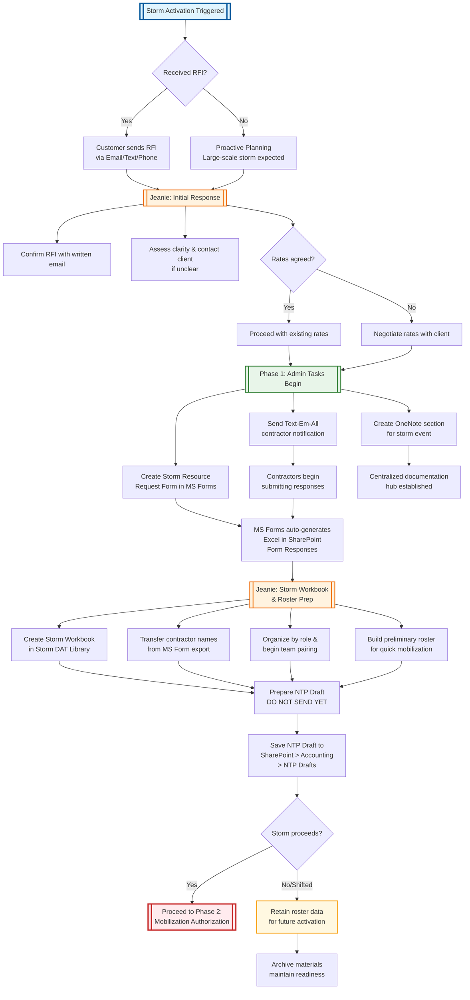

---
tags:
  - priority/high
  - type/doc
date: 2026-02-10
---
  Here's your document converted to **Obsidian Markdown** with full wiki-linking, callouts, and a comprehensive **Mermaid flowchart** at the end:

---

# Phase 1: Storm Activation

## 🔹 What Triggers This Phase

Storm Activation begins when [[Jeanie]] receives a [[Request for Information (RFI)]] or verbal notification from a customer via email, text, or phone call—or all three.

If the storm is expected to be large-scale (e.g., hurricane, major ice event), [[Grid Electric]] may begin proactive planning before a formal request is received.

> [!warning] Avoid Over-Alerting
> 
> We do not send mass notifications unless the likelihood of mobilization is strong. "Cry wolf" alerts lead to contractor disengagement.

---

## 🔹 Initial Response by Jeanie

1. **Confirm the RFI:** [[Jeanie]] always follows up with a written email to document the request—regardless of how it was initially received.
2. **Assess Clarity:** If the [[RFI]] is unclear, [[Jeanie]] contacts the client for clarification before proceeding.
3. **Rate Review:**
	- If set rates are already in place (e.g., with [[Oncor]]), no further negotiation is required.
	- If rates are not yet agreed upon, [[Jeanie]] negotiates personnel and expense reimbursement rates before mobilization proceeds.

---

## 🔹 Admin Responsibilities

1. Create [[Storm Resource Request Form]] (see [[MS Forms SOP]] for setup).
2. Send contractor notification via [[Text-Em-All]] (see [[Text-Em-All SOP]] for process and templates).
3. Admin creates a new section in the [[DAT Storm Team OneNote Notebook]], labeled with the storm event name.
4. [[MS Forms]] responses automatically generate an Excel file stored in [[Storm DAT SharePoint]] > [[Form Responses]]. This file tracks sign-ups only; [[Jeanie]] builds the official [[Storm Workbook]] separately in the main [[Storm DAT Library]]
5. [[Jeanie]] prepares the [[Notice to Proceed (NTP)]] but does not send it until full mobilization authorization is received.

---

## Storm Workbook Creation & Roster Preparation

When [[MS Form]] responses begin coming in, [[Jeanie]] immediately creates the [[Storm Workbook]] in [[SharePoint]]. All contractor names from the [[MS Form]] Excel export are transferred into this workbook and organized by role. Pairing begins right away to build a preliminary roster so [[Grid Electric]] is prepared to mobilize as soon as authorization is given.

> [!tip] Storm Shift/Cancel Note
> 
> Sometimes storms shift or are canceled after preparation. Even if the event doesn't move forward, maintaining this early roster ensures all resource data is ready for the next activation.

---

## 🔹 Admin Checklist (Phase 1)

- [ ] Create the [[Storm Resource Request Form]] (see [[MS Forms SOP]]).
- [ ] Send contractor notification via [[Text-Em-All]] (see [[Text-Em-All SOP]]).
- [ ] Create a new [[OneNote]] section for the storm event.
- [ ] Confirm Form settings: Anyone can respond, accept responses, and confirmation email is enabled.
- [ ] Monitor the [[MS Form]] Excel response file automatically saved in [[Storm DAT SharePoint]] > [[Form Responses]] — this is used only to track entries.
- [ ] Use the response data to create and update the [[Storm Workbook]], which is saved front and center in the [[Storm DAT Library]] as the active working roster.
- [ ] Save [[NTP]] draft to [[Storm DAT SharePoint]] > [[Accounting]] > [[NTP Drafts]].

---

> [!info] 📂 Naming Convention Reminder
> 
> All storm materials must follow this format:
> 
> `YYMMDD + [Customer(3)][Utility(3)][City(3)]`
> 
> **Example:** `250717QUAONCDFW` → July 17, 2025 | Qualus | Oncor | Dallas-Fort Worth
> 
> **Reminder:** [[SharePoint]] is the centralized file hub. Save the [[NTP]] draft to [[StormDAT SharePoint]] > [[Accounting]] > [[NTP Drafts]].

---

## 🔹 Workflow Diagram

The diagram below provides a visual summary of the Phase 1 process, showing the sequence of tasks and which role ([[Jeanie]] or Admin) is responsible for each step.

